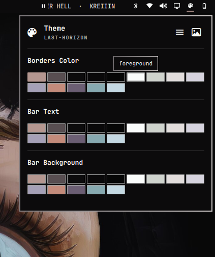

# Theme Extend



Bar widget para Omarchy que extiende el control de color de tu tema: elige el color de **borde (Hyprland)**, del **texto de la barra** y del **fondo de la barra** directamente desde un selector con todos los colores del tema activo.

## Caracteristicas

- **Borders Color**: selecciona un color y lo escribe en el archivo `hyprland.lua` del estado del tema (`active_border_color`), aplicandose a los bordes activos de ventanas y grupos.
- **Bar Text**: cambia el color del texto de la barra (`[bar] text` en `shell.toml`).
- **Bar Background**: cambia el color del fondo de la barra (`[bar] background` en `shell.toml`).
- **Hero integrado**: muestra el nombre del tema activo y dos botones de accion con tooltip:
  - `Switch Theme` — abre el selector de temas de Omarchy.
  - `Open Image Picker` — abre el selector de imagen de fondo de Omarchy.
- **Swatches del tema**: todas las paletas se leen de `colors.toml` del tema activo y se muestran en grids, con el color seleccionado actualmente marcado con borde de acento.
- **Tooltips con el estilo del shell**: cada swatch muestra el nombre del color con el mismo estilo de tooltip de los botones del hero.
- **Navegacion por teclado** dentro de las grillas de color (las secciones "Borders Color" y "Bar Background").

## Instalacion

1. Copia la carpeta del plugin a tu configuracion de Omarchy:

   ```bash
   mkdir -p ~/.config/omarchy/plugins
   cp -r famas.theme-extend ~/.config/omarchy/plugins/
   ```

2. Habilita el plugin:

   ```bash
   omarchy plugin enable famas.theme-extend
   ```

3. Colocalo en la barra (widget de barra):

   ```bash
   omarchy bar put famas.theme-extend
   ```

Tambien puedes validar el plugin con `omarchy plugin validate famas.theme-extend`.

## Uso

Haz clic en el icono de la paleta (󰏘) en la barra para abrir el panel. Se muestran tres secciones:

1. **Borders Color** — haz clic en un swatch para aplicar el color a los bordes activos de Hyprland. El swatch que coincide con el color escrito en `hyprland.lua` como `active_border_color` aparece marcado.
2. **Bar Text** — haz clic en un swatch para cambiar el color del texto de la barra.
3. **Bar Background** — haz clic en un swatch para cambiar el fondo de la barra.

Pasa el cursor sobre cualquier swatch para ver su tooltip con el nombre del color.

### Teclado

Con el panel abierto, puedes navegar con el teclado en las grillas habilitadas (Borders Color y Bar Background):

- `h` / `l` — moverse a izquierda / derecha.
- `j` / `k` — moverse hacia abajo / arriba (fila a fila).
- `Enter` / `Espacio` — aplicar el color enfocado.
- `Tab` / `Shift+Tab` — moverse entre paneles.
- `Esc` — cerrar.

## Que archivos modifica

| Accion | Archivo |
| --- | --- |
| Borders Color | `~/.local/state/omarchy/current/theme/hyprland.lua` (variable `active_border_color`) |
| Bar Text / Background | `~/.config/omarchy/shell.toml` (seccion `[bar]`) |

Si `hyprland.lua` no existe, el plugin crea una plantilla completa con `hl.config(...)` y un color de borde inactivo por defecto.

> Nota: los swatches de las grillas usan los colores que Omarchy escribe como valores hexadecimales. Si `shell.toml` usa un nombre de rol (p. ej. `foreground`) en lugar de un hex, ningun swatch aparece seleccionado hasta que elijas un color con el plugin.

## Requisitos

- Omarchy (shell `quickshell`).
- Fuente con iconos Nerd Fonts para los iconos del hero y del boton de la barra.
- Comandos `omarchy-theme-switcher`, `omarchy-theme-set`, `omarchy-theme-bg-switcher` y `omarchy-theme-bg-set` (incluidos en Omarchy) para los pickers de tema y fondo.

## Personalizacion

Las rutas de integracion estan definidas como propiedades al inicio de `Panel.qml` y pueden ajustarse:

- `omarchyStateDir` — directorio de estado del tema activo.
- `userShellPath` — ruta del `shell.toml` del usuario.

## Licencia

Uso personal. Se distribuye tal cual, sin garantias.
